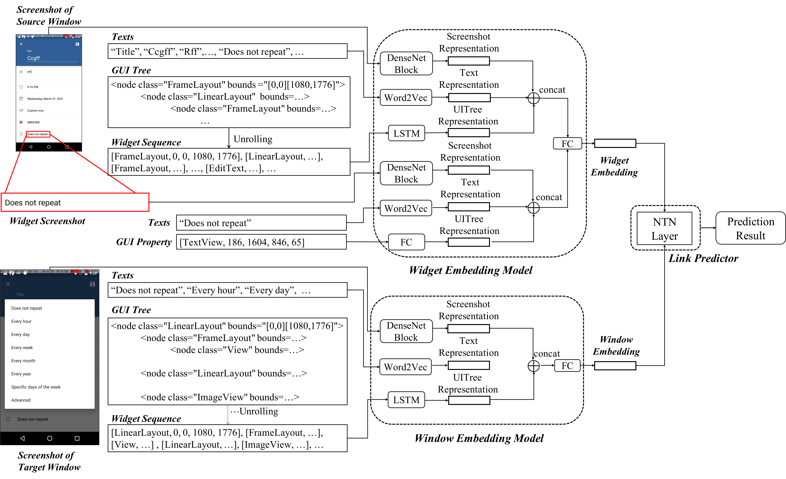

# Window Transition Prediction

Window transition learning contains the deep learning model to learn the transition relationship between a widget and an app window. The model consists of two embedding models and a link predictor. The two kinds of embedding models are the widget embedding model and the window embedding model. The embedding models use DenseNet to extract image features, a pre-trained Word2Vec model to extract text features and LSTM to extract features of UI layout trees. The link predictor is designed by leveraging the neural tensor network (NTN).

This is an example prediction using the window transition model. The screen snapshots, texts and UI layout trees of the source window and the target window are shown. The image, text and UI layout information of the source widget are highlighted with red frames.

<figure>
    
</figure>

## Introduction

This folder mainly contains the model training and predicting codes. It also includes some codes to pre-process the raw data collected from dynamic analysis tools or static analysis tools.

+ fine_tune.py: load the pre-processed data and fine tune the pre_trained model.
+ pre_train.py: load the pre-processed data collected by Paladin and pre-trained the model.
+ predict.py: load the pre-trained model and predict from the pre-processed data.
+ preprocessing.py: to pre-process the ground truth data, e.g., splitting data and save data as numpy files.
+ preprocessing_static.py: to pre-process the data collected by static analysis tools and save pre-processed data as numpy files.
+ model: the trained model to make window transition prediction.

## Requirements

+ Python >= 3.6.0
+ numpy >= 1.18.4
+ Keras >= 2.3.1
+ scikit-learn >= 0.22.2

## Entry Point

There are mainly 4 types of executable Python scripts as entry points:

### Pre-train

ProMal uses pre-processed data collected from Paladin to pre-trained the model. The input data need to be pre-processed in numpy format.
The screen snapshots and image of the source widgets need to be concatenated as numpys with shape [n, h, w, c] where n represents the number of images, h represents height, w represents width and c represents channel. 
The text information of each widget and window need to be extracted by a pre-trained Word2Vec model and the text vectors should be padded or cut to length 256. Besides, you should prepare the pre-trained Word2Vec model as well. 
As for UI layout tree features, you should traverse all widgets on the UI layout of an app window via in-order tree traversal to generate a widget sequence. The figure above shows how the tags and other information in a UI layout tree is unrolled to a sequence. The sequences should be saved as numpy as well. The tags, positions and size of each widget should also be saved as numpys in the same format. 
There needs to be a page_list.txt with all the names of the windows in the dataset, one name in each line. For example, the name of the window in app "com.example" with screen snapshot "examplewindow.png" is "com.example/examplewindow". There should also be a json file named "all_tags_dict.json" that can map each widget tag to a one-hot embedding. 

The apps for pre-training in our experiment are listed in [pretrain_apps.txt](https://github.com/ICSE2021Promal/promal/blob/master/WindowTransitionPrediction/pretrain_apps.txt)

+ Input.
Pre-processed Paladin data, Word2Vec model, page list file and tag dict file.
+ Output.
Pre-trained model to predict the transition relationship between widgets and windows.

To run the pre-train script:

```bash
python pre-train.py --data_dir <DATASET_DIR> --paladin_dir <PALADIN_DIR> --output_dir <OUTPUT_DIR>
```

### Pre-process for fine-tuning and prediction

Pre-process the groundtruth data and the data collected by static analysis tools and save the data as numpy files. It also splits the ground truth data into training and testing sets for 10-fold cross validation.

+ Input.
Groundtruth data and the data collected by static analysis tools. The Word2Vec model and the tag dict introduced in the [Pre-Training Entry Point](https://github.com/ICSE2021Promal/promal/tree/master/WindowTransitionPrediction#pre-train).

+ Output.
Numpy files needed for fine-tuning and prediction. The length of each numpy file is the total number of widgets or windows in the pre-processed dataset. Note that there should be enough space on disk for the output data.

To run the pre-processing script:

```bash
python preprocessing.py --data_dir <DATASET_DIR> --groundtruth_dir <GROUNDTRUTH_DIR> --output_dir <OUTPUT_DIR>
python preprocessing_static.py --data_dir <DATASET_DIR> --static_dir <STATIC_DIR> --output_dir <OUTPUT_DIR>
```

### Fine-tune

Fine tune the pre-trained model with ground truth data.

+ Input.
Directory to pre-processed data directory and pre-trained model.
+ Output.
Fine-tuned model to predict the transition relationship between widgets and windows.

To run the fine-tuning script:

```bash
python fine_tuning.py --data_dir <DATASET_DIR> --model_dir <MODEL_DIR> --output_dir <OUTPUT_DIR>
```

### Predict

Load the trained model and give the prediction result.

+ Input.
The trained model and the pre-processed data to be predicted. The app name, source activity and target activity that can be found in the preprocessed dataset should also be specified. If there is a certain source widget, the widget id can also be specified.
+ Output.
Prediction result which is a score between 0 and 1. The higher the score is, the more likely that there exists a link between the input windows or the input widget and window. The threshold of the prediction score can be adjusted accordingly.

To run the prediction script:

```bash
python predict.py --data_dir <DATASET_DIR> --model_dir <MODEL_DIR> --output_dir <OUTPUT_DIR> --app <APP> --widget_name <OUTPUT_DIR> --source_activity <SOURCE_ACTIVITY> --target_actiivty <TARGET_ACTIVITY>
```
